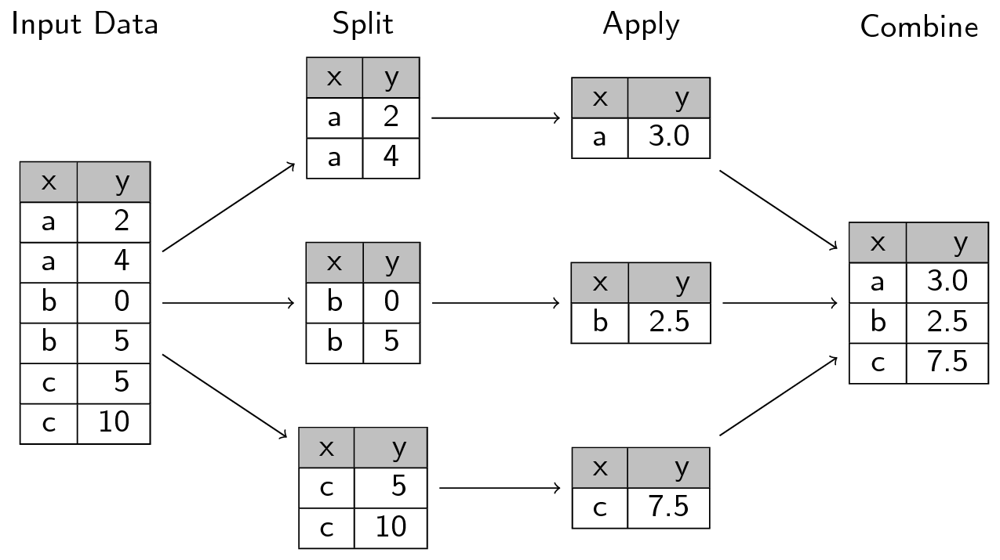
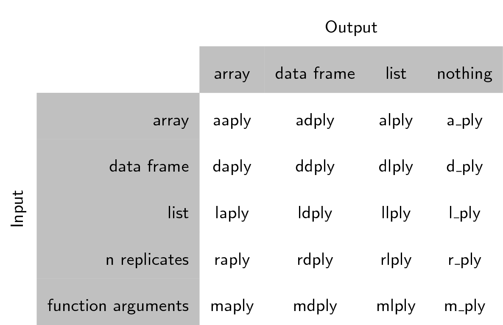

---
# Please do not edit this file directly; it is auto generated.
# Instead, please edit 12-plyr.md in _episodes_rmd/
title: "División y combinación de data frames con plyr"
teaching: 30
exercises: 30
questions:
- "¿Cómo puedo hacer diferentes cálculos sobre diferentes conjuntos de datos?"
objectives:
- "Estar apto a usar la estrategia divide-aplica-combina para el análisis de datos."
keypoints:
- "Uso del paquete `plyr` para dividir datos, aplicar funciones sobre subconjuntos, y combinar los resultados"
source: Rmd
---

Previamente vimos como puedes usar funciones para simplificar tu código.
Definimos la función `calcGDP`, la cual toma el **dataset**  gapminder, y multiplica la columna de población por la columna GDP per cápita. También definimos argumentos adicionales de modo que pudiéramos filtrar por `"year"` o por `"country"`:

~~~
# Toma un dataset y multiplica la columna population con
# la columna GDP per cápita.
calcGDP <- function(dat, year=NULL, country=NULL) {
  if(!is.null(year)) {
    dat <- dat[dat$year %in% year, ]
  }
  if (!is.null(country)) {
    dat <- dat[dat$country %in% country,]
  }
  gdp <- dat$pop * dat$gdpPercap

  new <- cbind(dat, gdp=gdp)
  return(new)
}
~~~
{: .language-r}

Una tarea común que encontrarás mientras trabajes con datos, es que querrás hacer cálculos en diferentes grupos sobre los datos. En el ejemplo de arriba, simplemente calculamos  el GDP  por multiplicar dos columnas juntas.  ¿Pero qué tal si queremos calcular la media GDP por continente?  

Podríamos ejecutar `calcGDP`  y entonces tomar la media  de cada continente:

~~~
withGDP <- calcGDP(gapminder)
mean(withGDP[withGDP$continent == "Africa", "gdp"])
~~~
{: .language-r}

~~~
[1] 20904782844
~~~
{: .output}

~~~
mean(withGDP[withGDP$continent == "Americas", "gdp"])
~~~
{: .language-r}

~~~
[1] 379262350210
~~~
{: .output}

~~~
mean(withGDP[withGDP$continent == "Asia", "gdp"])
~~~
{: .language-r}

~~~
[1] 227233738153
~~~
{: .output}

Pero esto no es muy *bonito*. Sí, por usar una función, has reducido substancialmente la cantidad de repeticiones. Esto **es** bonito. Pero aún hay repeticiones. La repetición te costará tiempo, tanto ahora como más tarde, y potencialmente introducirás algunos errores desagradables.

Podriamos escribir una nueva función que sea flexible como `calcGDP`,  pero esta también requiere una gran cantidad de esfuerzo y pruebas para hacerlo bien.

El problema abstracto que estamos encontrando aquí es conocido como "divide-aplica-combina (*split-apply-combine*)":

Nosotros queremos dividir (*split*) nuestros datos dentro de grupos, en este caso continentes, aplicar (*apply*) algunos cálculos sobre este grupo y, opcionalmente, combinar (*combine*) los resultados más tarde.

## El paquete `plyr`

Para aquellos que han usado antes R, es posible que estén familiarizados con la familia de funciones `apply`. Mientras que las funciones integradas de R funcionan, vamos a introducirte a otro método para resolver el problema
"split-apply-combine". El paquete [plyr](http://had.co.nz/plyr/) proporciona un conjunto de funciones que encontramos más amigables de usar para resolver este problema.

Instalamos este paquete en un desafío anterior. Vamos a cargarlo ahora:

~~~
library("plyr")
~~~
{: .language-r}

Plyr tiene una función para operar sobre listas o `**lists**` , `**data.frames**` y `**arrays**` (matrices, o vectores n-dimensional). Cada función realiza:

1. Una operación de división (**split**ting).
2. Aplica (**apply**) una función sobre cada una de las partes a la vez.
3. Recombina (re**combine**) los datos de salida como un simple objeto de datos.

Las funciones se nombran en función de la estructura de datos que esperan como entrada, y la estructura de datos que desea devolver como salida: [a]rray, [l]ist, o [d]ata.frame. La primera letra corresponde a la estructura de datos de entrada, la segunda letra a la estructura de datos de salida, y luego el resto de la función se llama "ply".

Esto nos da 9  funciones básicas **ply.  Hay adicionalmente un árbol de funciones  las cuales solo realizarán la división y aplicación de los pasos y ningún paso combinado. Ellas son nombradas por sus datos de entrada y representan una salida nula con un `_` (Ver tabla)

Note que el uso de "array" de plyr es diferente a R, un array en ply puede  incluir a vector o matriz.

Cada una de las funciones de xxply (`daply`,` ddply`, `llply`,` laply`, ...) tiene la misma estructura y 4 características clave:

~~~
xxply(.data, .variables, .fun)
~~~
{: .language-r}

* La primera letra del nombre de la función da el tipo de la entrada y el segundo da el tipo de la salida.
* `.data` – Es el objeto de datos a ser procesado
* `.variables` – identifica la variable para hacer la división
* `.fun` – Da la función a ser llamada para cada pieza

Ahora podemos calcular rápidamente la media GDP por `"continent"`:

~~~
ddply(
 .data = calcGDP(gapminder),
 .variables = "continent",
 .fun = function(x) mean(x$gdp)
)
~~~
{: .language-r}

~~~
  continent           V1
1    Africa  20904782844
2  Americas 379262350210
3      Asia 227233738153
4    Europe 269442085301
5   Oceania 188187105354
~~~
{: .output}
Veamos el código anterior:

- La función  `ddply` recibe de entrada un  `data.frame` (La función empieza con una **d**)  y regresa  otro `data.frame` (la 2da letra es una  **d**)
- El primer argumento que dimos fue el `data.frame` en el que queríamos operar: en este caso, los datos del `gapminder`. Primero llamamos a la función `calcGDP` para agregar la columna` gdp` a nuestra variable *data*.
-  El segundo argumento indica nuestro criterio para dividir: En este caso la columna `"continent"`. Ten en cuenta que le dimos el nombre de la columna, no los valores de la columna como habíamos hecho previamente con los subconjuntos. `Plyr` se encarga de los detalles de la implementación por ti.
- El tercer argumento es la función que queremos aplicar a cada grupo de datos. Tenemos que definir nuestra propia función corta aquí:  cada subconjunto de datos va almacenado en `x`, el primer argumento de la función. Esta es una  función anónima: no la hemos definido en otra parte y no tiene nombre. Solo existe en el ámbito de nuestro llamado a  `ddply`.

¿Qué pasa si queremos un tipo diferente de estructura de datos de salida?:

~~~
dlply(
 .data = calcGDP(gapminder),
 .variables = "continent",
 .fun = function(x) mean(x$gdp)
)
~~~
{: .language-r}

~~~
$Africa
[1] 20904782844

$Americas
[1] 379262350210

$Asia
[1] 227233738153

$Europe
[1] 269442085301

$Oceania
[1] 188187105354

attr(,"split_type")
[1] "data.frame"
attr(,"split_labels")
  continent
1    Africa
2  Americas
3      Asia
4    Europe
5   Oceania
~~~
{: .output}

Llamamos a la misma función otra vez, pero cambiamos la segunda letra por una `l`,  asi que la salida fue regresada como una lista.

Podemos especificar múltiples columnas para agrupar:

~~~
ddply(
 .data = calcGDP(gapminder),
 .variables = c("continent", "year"),
 .fun = function(x) mean(x$gdp)
)
~~~
{: .language-r}

~~~
   continent year           V1
1     Africa 1952   5992294608
2     Africa 1957   7359188796
3     Africa 1962   8784876958
4     Africa 1967  11443994101
5     Africa 1972  15072241974
6     Africa 1977  18694898732
7     Africa 1982  22040401045
8     Africa 1987  24107264108
9     Africa 1992  26256977719
10    Africa 1997  30023173824
11    Africa 2002  35303511424
12    Africa 2007  45778570846
13  Americas 1952 117738997171
14  Americas 1957 140817061264
15  Americas 1962 169153069442
16  Americas 1967 217867530844
17  Americas 1972 268159178814
18  Americas 1977 324085389022
19  Americas 1982 363314008350
20  Americas 1987 439447790357
21  Americas 1992 489899820623
22  Americas 1997 582693307146
23  Americas 2002 661248623419
24  Americas 2007 776723426068
25      Asia 1952  34095762661
26      Asia 1957  47267432088
27      Asia 1962  60136869012
28      Asia 1967  84648519224
29      Asia 1972 124385747313
30      Asia 1977 159802590186
31      Asia 1982 194429049919
32      Asia 1987 241784763369
33      Asia 1992 307100497486
 [ reached getOption("max.print") -- omitted 27 rows ]
~~~
{: .output}

~~~
daply(
 .data = calcGDP(gapminder),
 .variables = c("continent", "year"),
 .fun = function(x) mean(x$gdp)
)
~~~
{: .language-r}

~~~
          year
continent          1952         1957         1962         1967
  Africa     5992294608   7359188796   8784876958  11443994101
  Americas 117738997171 140817061264 169153069442 217867530844
  Asia      34095762661  47267432088  60136869012  84648519224
  Europe    84971341466 109989505140 138984693095 173366641137
  Oceania   54157223944  66826828013  82336453245 105958863585
          year
continent          1972         1977         1982         1987
  Africa    15072241974  18694898732  22040401045  24107264108
  Americas 268159178814 324085389022 363314008350 439447790357
  Asia     124385747313 159802590186 194429049919 241784763369
  Europe   218691462733 255367522034 279484077072 316507473546
  Oceania  134112109227 154707711162 176177151380 209451563998
          year
continent          1992         1997         2002         2007
  Africa    26256977719  30023173824  35303511424  45778570846
  Americas 489899820623 582693307146 661248623419 776723426068
  Asia     307100497486 387597655323 458042336179 627513635079
  Europe   342703247405 383606933833 436448815097 493183311052
  Oceania  236319179826 289304255183 345236880176 403657044512
~~~
{: .output}

Puedes usar estas funciones en lugar de ciclos `for` (y generalmente es mas rápido).
Para remplazar un ciclo ‘for’,  pon el código que estaba en el cuerpo del ciclo `for`  dentro de la función anónima.

~~~
d_ply(
  .data=gapminder,
  .variables = "continent",
  .fun = function(x) {
    meanGDPperCap <- mean(x$gdpPercap)
    print(paste(
      "La media GDP per cápita para", unique(x$continent),
      "es", format(meanGDPperCap, big.mark=",")
   ))
  }
)
~~~
{: .language-r}

~~~
[1] "La media GDP per cápita para Africa es 2,193.755"
[1] "La media GDP per cápita para Americas es 7,136.11"
[1] "La media GDP per cápita para Asia es 7,902.15"
[1] "La media GDP per cápita para Europe es 14,469.48"
[1] "La media GDP per cápita para Oceania es 18,621.61"
~~~
{: .output}

> ## Sugerencia: Imprimiendo números
>
> La función  `format`  puede ser usada para imprimir los valores numéricos  
> "bonitos" en los mensajes.
{: .callout}

> ## Desafío 1
>
> Calcula el promedio de vida esperado por `"continent"`. ¿Quién tiene el promedio mas alto?
> ¿Quién tiene el mas pequeño?
{: .challenge}

> ## Desafío 2
>
> Calcula el promedio de vida esperado por `"continent"` y `"year"`. ¿Quién tiene el promedio mas
> grande y mas corto en 2007? ¿Quién tiene el cambio mas grande entre 1952
> y 2007?
{: .challenge}

> ## Desafío Avanzado
>
> Calcula la diferencia en la media de vida esperada entre los
> años  1952 y 2007 a partir de la salida del desafío 2
> usando una de las funciones `plyr`.
{: .challenge}

> ## Desafío alterno si la clase parece perdida
>
> Sin ejecutarlos, cuál de los siguientes calculará el promedio
> de la esperanza de vida por continente:
>
> 1.
> 
> ~~~
> ddply(
>   .data = gapminder,
>   .variables = gapminder$continent,
>   .fun = function(dataGroup) {
>      mean(dataGroup$lifeExp)
>   }
> )
> ~~~
> {: .language-r}
>
> 2.
>
> 
> ~~~
> ddply(
>   .data = gapminder,
>   .variables = "continent",
>   .fun = mean(dataGroup$lifeExp)
> )
> ~~~
> {: .language-r}
>
> 3.
>
> 
> ~~~
> ddply(
>   .data = gapminder,
>   .variables = "continent",
>   .fun = function(dataGroup) {
>      mean(dataGroup$lifeExp)
>   }
> )
> ~~~
> {: .language-r}
>
> 4.
> 
> ~~~
> adply(
>   .data = gapminder,
>   .variables = "continent",
>   .fun = function(dataGroup) {
>      mean(dataGroup$lifeExp)
>   }
> )
> ~~~
> {: .language-r}
>
{: .challenge}


